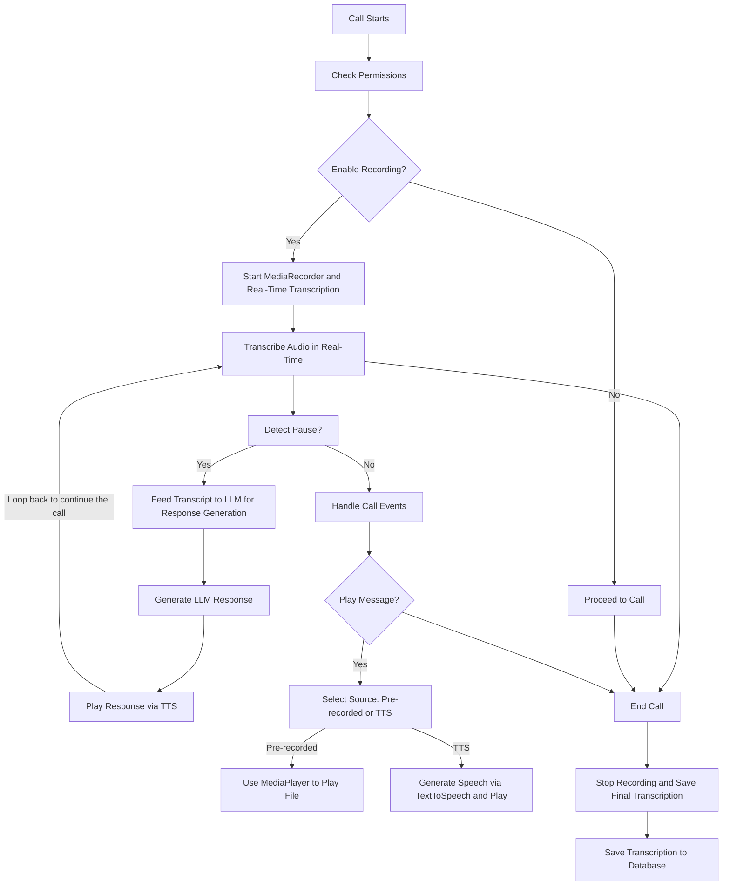

# Dialer App Enhancement Design

## Overview
This document outlines modifications to add call recording, transcription, and message playback to the existing Dialer app.

## Feature 1: Call Recording
- **Objective:** Enable audio recording during calls.
- **Injection Point:** In `com.goodwy.dialer.activities.CallActivity.kt` or `com.goodwy.dialer.services.CallService.kt`, modify the call state listener.
- **Implementation Steps:**
  1. Request RECORD_AUDIO permission in `onCreate`.
  2. Use `MediaRecorder` to start recording on call start and stop on call end.
  3. Store files in app's internal storage and link to call logs in `AppDatabase.kt`.
- **Potential Code Snippet:**
   ```kotlin
   fun startRecording() {
       val recorder = MediaRecorder().apply {
           setAudioSource(MediaRecorder.AudioSource.VOICE_CALL)
           setOutputFormat(MediaRecorder.OutputFormat.MPEG_4)
           setOutputFile(getRecordingFilePath())
           prepare()
           start()
       }
   }
   ```

## Feature 2: Call Transcription
- **Objective:** Transcribe recorded calls for review.
- **Injection Point:** Extend `com.goodwy.dialer.helpers.CallManager.kt` for audio processing.
- **Implementation Steps:**
  1. After recording, pass audio to `SpeechRecognizer` or send to a cloud service.
  2. Process in a background thread and save results.
- **Potential Code Snippet:**
   ```kotlin
   fun transcribeAudio(filePath: String) {
       val recognizer = SpeechRecognizer.createSpeechRecognizer(context)
       recognizer.setRecognitionListener(object : RecognitionListener { ... })
       recognizer.startListening(Intent().apply { ... })
   }
   ```

## Feature 3: Message Playback
- **Objective:** Play messages from pre-recorded files or real-time TTS.
- **Injection Point:** In `com.goodwy.dialer.activities.CallActivity.kt`, add UI controls.
- **Implementation Steps:**
  1. For pre-recorded: Load via `MediaPlayer`.
  2. For TTS: Use `TextToSpeech` with LLM input.
- **Potential Code Snippet:**
   ```kotlin
   fun playTTSMessage(text: String) {
       val tts = TextToSpeech(context, null).apply {
           speak(text, TextToSpeech.QUEUE_FLUSH, null, null)
       }
   }
   ```

## Risks and Testing
- Handle exceptions for audio failures and ensure compatibility across Android versions.
- Test in emulators and real devices for call scenarios.

## Call Flow Diagram
Here is an updated Mermaid diagram illustrating the call flow, including real-time transcription and LLM integration for response generation during pauses:


